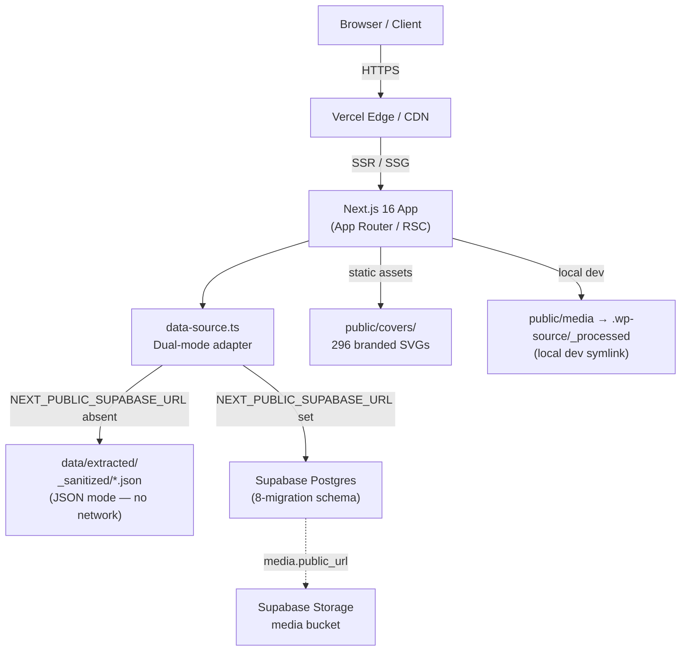
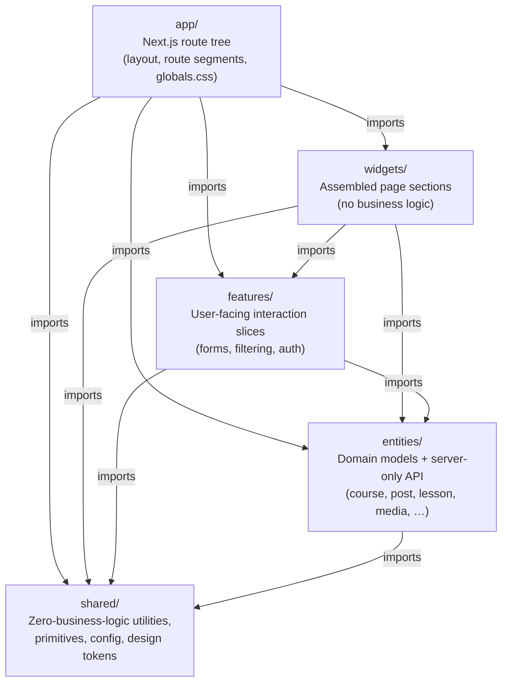
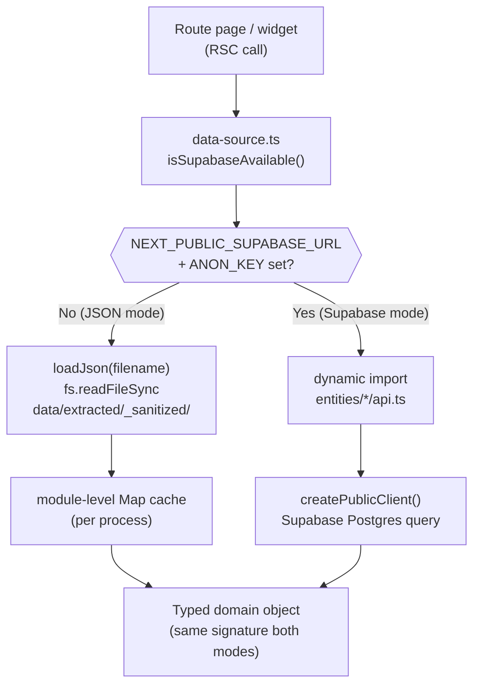
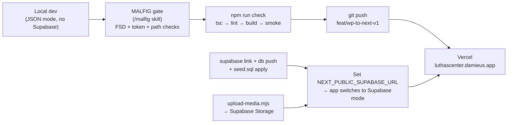

# Luthas Center — Technical Solution Architecture

**Last updated:** <!-- YYYY-MM-DD — update on each structural change -->  
**Branch:** `feat/wp-to-next-v1`  
**Status:** v1 complete locally; one external gate remains (Supabase cloud project creation — P5)

---

## Table of Contents

1. [System Overview](#1-system-overview)
2. [Tech Stack](#2-tech-stack)
3. [FSD Layer Architecture](#3-fsd-layer-architecture)
4. [Data Layer & Dual-Mode Adapter](#4-data-layer--dual-mode-adapter)
5. [Data Model](#5-data-model)
6. [Content Migration Pipeline](#6-content-migration-pipeline)
7. [Media Architecture](#7-media-architecture)
8. [Routing](#8-routing)
9. [Design System](#9-design-system)
10. [SEO](#10-seo)
11. [Deployment & CI](#11-deployment--ci)
12. [Quality Gates](#12-quality-gates)
13. [Governance](#13-governance)
14. [Decisions (ADR)](#14-decisions-adr)
15. [Known Gaps & Roadmap](#15-known-gaps--roadmap)

---

## 1. System Overview

### What it is

Luthas Center for Excellence is a non-profit education and community platform (luthascenter.com). The project is a **curated rebuild** — not a 1:1 migration — from a self-hosted WordPress/LearnDash/GiveWP/WooCommerce stack onto a modern Next.js + Supabase stack. "Curated" means only quality content survives: 47 published courses (with real curriculum), 668 sanitized blog posts, 14 pages, 3 donation forms, and deduplicated media. Demo data, auto-generated/scraped posts (stub guard: < 200 chars), empty-shell courses (no lessons/quizzes), and all payment PII are discarded.

### Why a rebuild

Headless WordPress would require keeping WP/LearnDash/GiveWP/Woo hosting running indefinitely. The rebuild decommissions WP entirely: content was extracted once from a SQL dump + on-disk `wp-content` archive, sanitized, and sealed as JSON artifacts in `data/extracted/_sanitized/`. The MySQL container no longer exists; those JSON files are the only copy of the source data.

### Current state (as of 2026-06-09)

The v1 site is feature-complete locally on `feat/wp-to-next-v1`. `npm run dev` renders real migrated content via the JSON-fallback adapter (no Supabase needed). `npm run check` (tsc + lint + build + runtime smoke) is green: 514/514 smoke passes. The Supabase schema (8 migrations) and 18 MB seed SQL exist but have not yet been applied to a cloud project — that is the sole remaining gate before Vercel deploy to `luthascenter.damieus.app`.

### Goals

Courses, blog, and static donation CTA live at launch (v1). Auth/admin, store, and community are deferred (D1). Media fully migrated to Supabase Storage (2,932 webp processed; 420 Google-Drive-offloaded images covered by 296 branded SVG covers). Per-route metadata, sitemap, robots.txt, JSON-LD, and a 686-entry 301 redirect map (dormant until `luthascenter.org/.com` is purchased) are built.

### Non-goals (v1)

Native payments (Stripe static CTA only), auth-gated course access, community features, WooCommerce store, Playwright E2E, ISR for the 668-post blog, a11y pass.

### System context diagram



---

## 2. Tech Stack

> **Important caveat — this is NOT the Next.js you know.** The project targets Next.js 16 (App Router / RSC). APIs, conventions, and file structure may differ from training data. `AGENTS.md` mandates reading `node_modules/next/dist/docs/` before writing any Next.js code and heeding all deprecation notices. Notably, `src/middleware.ts` carries a comment that it should be renamed `proxy.ts` per a Next 16 advisory.

| Layer | Technology | Notes |
|---|---|---|
| Framework | Next.js 16 — App Router, React Server Components | All routes are server-rendered by default; `'use client'` only where interaction is required |
| UI runtime | React 19 | |
| Styling | Tailwind CSS v4 with `@theme` block | All design tokens are CSS custom properties in `src/app/globals.css`; no raw hex values in components |
| Fonts | `next/font/google` — Montserrat (`--font-heading`) + Lato (`--font-body`) | Loaded in root layout |
| Database | Supabase Postgres | 8-migration schema; RLS enabled on all tables |
| Object storage | Supabase Storage | `media` bucket; upload script ready but not yet run against a cloud project |
| Auth | Supabase Auth via `@supabase/ssr` | Server client reads cookies; action client writes cookies; deferred for v1 public site |
| Architecture | Feature-Sliced Design (FSD) | Strict top-down import direction enforced |
| Deployment | Vercel | Target: `luthascenter.damieus.app`; CI = MALFIG; no `.github/workflows/` |
| Content transform | Custom `wp-content` pipeline | Gutenberg stripper → shortcode unwrapper → internal link rewriter → unreachable image replacer |

---

## 3. FSD Layer Architecture

The `src/` directory follows Feature-Sliced Design with strict top-down import rules: layers may only import from layers *below* them. Cross-slice imports within a layer are prohibited.



### Layer descriptions

**`app/`** — Next.js route tree. Contains `layout.tsx` (root shell: fonts, SiteHeader, SiteFooter, Organization JSON-LD), `globals.css` (the `@theme` token block), `sitemap.ts`, `robots.ts`, and route segments: `/`, `/about`, `/blog/[[...slug]]`, `/courses/[[...slug]]`, `/donate`, `/give`, `/contact`, `/[pageSlug]`. Route pages are thin RSC shells that call data-source functions and render widget/entity components.

**`widgets/`** — Self-contained page sections composed from entities and shared primitives. Current slices: `site-header`, `site-footer`, `home-hero`, `home-donate`, `home-newsletter`, `course-catalog`, `course-detail`, `lesson-view`, `post-detail`, `blog-filter-bar`, `blog-pagination`, `donate-form`, `contact-form`, `about-hero`. Widgets may import from `features/`, `entities/`, and `shared/` but not from `app/`.

**`features/`** — Interaction slices. Current slices: `admin`, `auth`, `blog`, `contact`, `courses`, `donate`, `resources` (present but effectively dormant; `/resources` route is dropped per D5). Features import from `entities/` and `shared/` only.

**`entities/`** — One slice per domain object: `course`, `lesson`, `quiz`, `post`, `page`, `media`, `term`, `profile`, `product`, `donation`. Each slice contains `model.ts` (TypeScript interfaces), `api.ts` (server-only async functions with `import 'server-only'`), `ui/` (presentational components), and `index.ts` (public barrel). Entities may only import from `shared/`.

**`shared/`** — Subdivided into:
- `shared/lib/` — `data-source.ts`, `supabase/` (client variants), `wp-content/` (transform pipeline), `slugify.ts`
- `shared/ui/` — Handbuilt primitives: `Accordion`, `Alert`, `Avatar`, `Badge`, `Breadcrumb`, `Button`, `Card`, `FormField`, `Pagination`, `Prose`, `Separator`, `Skeleton`
- `shared/design/` — `tokens.ts` SSOT; values flow into `globals.css @theme`
- `shared/config/` — `redirects.generated.ts` (686-entry 301 map)
- `shared/types/` — `database.ts` (Supabase-generated Database type)
- `shared/hooks/` — Client-side hooks

**Server-only boundaries.** All `entities/*/api.ts` files and `src/shared/lib/data-source.ts` begin with `import 'server-only'`. They must not be imported from `'use client'` components.

**`src/middleware.ts`** — Edge middleware implementing the 686-entry 301 redirect map. Dormant by default (`ENABLE_WP_REDIRECTS !== '1'`). The file carries a comment to rename it `proxy.ts` per a Next 16 advisory once the legacy domain is activated.

---

## 4. Data Layer & Dual-Mode Adapter

**File:** `src/shared/lib/data-source.ts`

### Dual-mode flow



### Mode detection

```ts
export function isSupabaseAvailable(): boolean {
  return Boolean(
    process.env.NEXT_PUBLIC_SUPABASE_URL &&
    process.env.NEXT_PUBLIC_SUPABASE_ANON_KEY,
  )
}
```

- **JSON mode** (both vars absent): reads from `data/extracted/_sanitized/*.json` via `fs.readFileSync`. Files are parsed once and cached in a module-level `Map<string, unknown>`. This is the current operating mode for local development — no Supabase project required.
- **Supabase mode** (both vars present): dynamically imports the corresponding `entities/*/api.ts` function. The call signature is identical in both modes.

### JSON-mode internals

`loadJson<T>(filename)` reads from `data/extracted/_sanitized/<filename>`, expects a `{ records: T }` envelope, and returns `records`. Filenames: `courses.json`, `lessons.json`, `posts.json`, `pages.json`, `media.json`, `donations.json`, `products.json`, `profiles.json`. `taxonomy.json` lives at `data/extracted/taxonomy.json` and is handled separately.

### Slug resolution

LearnDash stored courses and lessons with numeric or empty WP slugs. The adapter builds a deterministic `wp_id → title-slug` map on first access (`buildTitleSlugMap`): records sorted by `wp_id` ascending; `slugify(title)` is the base; collisions get a numeric suffix (`-2`, `-3`, …). Blog posts keep their real WP `post_name`; only blank `post_name` values fall back to `slugify(title)`.

### Curation filters applied at query time

- **Courses**: listings, detail page, and sitemap exclude courses where `step_counts.lessons = 0` AND `step_counts.quizzes = 0` (empty-shell courses). Pending-status courses are always excluded.
- **Posts**: `listPosts`, `countPosts`, and sitemap exclude posts whose HTML content, after stripping tags, is fewer than 200 characters (stub guard). Stubs remain fetchable by direct slug lookup via `getPostBySlug`.

### Supabase client variants

Three clients are exported from `src/shared/lib/supabase/server.ts` (all server-only):

| Function | Transport | Use case |
|---|---|---|
| `createPublicClient()` | `@supabase/supabase-js` direct, `persistSession: false`, no cookies | Public read-only data in Server Components and `generateStaticParams` |
| `createClient()` | `@supabase/ssr` `createServerClient`, reads `cookies()` | Server Components that need the user session |
| `createActionClient()` | `@supabase/ssr` `createServerClient`, reads + writes `cookies()` | Route Handlers and Server Actions that must refresh/write auth cookies |

A fourth client, `src/shared/lib/supabase/client.ts`, uses `createBrowserClient` from `@supabase/ssr` — for `'use client'` components only.

All four clients throw at call time (not import time) if the required env vars are absent, so JSON-fallback mode does not crash on import.

### Media resolution

`resolveMediaUrl(media: MediaRow): string` — priority chain:
1. `media.public_url` present → return it (Supabase Storage public URL post-upload)
2. `media.attached_file` → look up in `data/extracted/media-url-manifest.json`; if `bytes_before > 0` and `processed_path` is set, return `/media/<relative>` (dev: `public/media` symlink → `.wp-source/_processed`; production: same relative path from the Supabase `media` bucket)
3. Orphan/Google-Drive-offloaded/unmatched → return `/placeholder-cover.svg`

`resolveCoverUrl(media: MediaRow | null, type: 'course' | 'post', slug: string): string` — priority chain:
1. `resolveMediaUrl` returns something other than `/placeholder-cover.svg` → use the real image
2. Per-item branded SVG at `public/covers/<type>-<slug>.svg` on disk (296 SVGs for affected courses and posts)
3. Final fallback: `/placeholder-cover.svg`

### Request flow (Supabase mode example — course detail)

```
app/courses/[slug]/page.tsx (RSC)
  └─ data-source.ts → getCourseWithCurriculum(slug)
       └─ isSupabaseAvailable() → true
          └─ dynamic import entities/course/api.ts
               ├─ createPublicClient() → supabase.from('courses').select(…)
               ├─ supabase.from('course_steps').select(…)
               └─ Promise.all([
                    entities/lesson/api.ts → createPublicClient()
                    entities/quiz/api.ts   → createPublicClient()
                  ])
          → CourseWithCurriculum { …course, lessons, quizzes, steps }
  └─ widgets/course-detail renders assembled data
       └─ resolveMediaUrl / resolveCoverUrl called per-image in Server Component
```

---

## 5. Data Model

The schema lives in `supabase/migrations/` across 8 ordered files (`20260608000001` – `20260608000008`). All tables use UUID primary keys with WP integer IDs carried as `wp_id` / `wp_attachment_id` natural-key columns for seed correlation. RLS is enabled on all tables.

### Shared substrate (migrations 1–2)

**`profiles`** — extends `auth.users`. Columns: `wp_user_id` (unique), `auth_user_id` (nullable FK → `auth.users.id`), `username`, `display_name`, `email`, `role` (enum: `student | author | admin | owner`), `avatar_media_id`, `bio`. Two `SECURITY DEFINER` helpers drive all write RLS: `is_admin()` and `is_owner()`. Seeded WP users have no `auth.users` row; `auth_user_id` is nullable specifically for this reason.

**`media`** — WP attachment manifest. Columns: `wp_attachment_id` (unique), `storage_path`, `public_url` (both NULL until upload script runs), `source_url`, `attached_file`, `mime_type`, `width`, `height`, `alt_text`, `title`, `post_parent`, `sizes` (JSONB).

**`terms`** — unified WP taxonomy terms. Columns: `wp_term_id`, `name`, `slug`, `taxonomy`, `parent_id`, `count`.

**`term_relationships`** — polymorphic object-to-term join. `object_type` TEXT, `object_id` INTEGER (WP id), `wp_term_id` FK. Unique on `(object_type, object_id, wp_term_id)`.

**`seo_meta`** — polymorphic SEO per object. Unique on `(object_type, object_id)`. Fields: `meta_title`, `meta_description`, `og_image_media_id`, `focus_keyword`.

**`pages`** — WP pages. Columns: `wp_id`, `slug`, `title`, `content`, `excerpt`, `status`, `parent_id`, `menu_order`, `page_template`, `author_id`, `featured_image_id`.

### Per-domain tables (migrations 3–6)

**LMS (migration 3):**

| Table | Key fields |
|---|---|
| `courses` | `slug`, `price_type` (enum: `open/free/paid/closed`), `access_mode`, `step_counts` (JSONB: `{lessons, quizzes}`), `featured_image_id`, `cover_image_id`, `old_path`, `new_path` |
| `lessons` | FK `course_id → courses.wp_id`, `sort_order`, `video_url` |
| `quizzes` | FK `course_id → courses.wp_id`, optional `lesson_id → lessons.wp_id`, `passing_percentage` |
| `course_steps` | FK `course_id` (cascade delete), `step_type` (enum: `lesson/quiz/topic`), `step_ref_id`, `position`. Unique on `(course_id, step_type, step_ref_id)` |
| `enrollments` | Schema present, not seeded in v1. FK `user_id → profiles.id`, `course_id → courses.wp_id` |

**Posts (migration 4):** `posts` table — `author_id → profiles.wp_user_id`, `featured_image_id`, `reading_time`, `old_path`, `new_path`. Index on `published_at DESC`.

**Commerce (migration 5) — schema present, not used in v1:** `products` (WooCommerce fields including `sku`, `stock_status`, `price`) and `product_attributes` (FK `product_id`, cascade delete).

**Donations (migration 6):** `donation_forms` (GiveWP forms: `goal_amount`, `price_levels` JSONB, `image_id`) and `donation_stats` (aggregate totals per form, public read).

### Derived view (migration 7)

**`catalog_items`** — `UNION ALL` of published courses and published products with `kind` enum (`course | product`). Declared `WITH (security_invoker = true)` so RLS from underlying tables applies.

### Storage (migration 8)

A `media` bucket (`public = true`, 25 MB file limit, MIME whitelist: webp/jpeg/png/svg/gif/avif). Storage RLS mirrors the table pattern: public read; admin required for writes.

### RLS pattern

- **SELECT** — `status = 'publish'` (or `true` for lookup tables). Admins get unrestricted SELECT via `is_admin()`.
- **INSERT / UPDATE / DELETE** — `is_admin()` (SECURITY DEFINER). Exception: `profiles` has a self-update policy (`auth.uid() = auth_user_id`).

---

## 6. Content Migration Pipeline

### Overview

```mermaid
flowchart LR
    WP["WP SQL dump\n+ wp-content archive"]
    EXTRACT["scripts/extract/\n(run once, MySQL container now gone)"]
    RAW["data/extracted/\n*.json (raw)"]
    SANITIZE["sanitize.ts\nCuration rules + parity assert"]
    CLEAN["data/extracted/_sanitized/\n*.json (sealed in git)"]
    PIPELINE["src/shared/lib/wp-content/\nWP_CLEAN_PIPELINE\n(Gutenberg → shortcode → links → images)"]
    SEED["scripts/seed/build-seed.ts\n→ supabase/seed.sql (18 MB)"]
    APPLY["scripts/supabase/apply.mjs\nmigrations + seed + parity verify"]
    CLOUD["Supabase Postgres\n(NOT YET APPLIED)"]
    UPLOAD["scripts/supabase/upload-media.mjs\n→ Supabase Storage media bucket"]

    WP --> EXTRACT
    EXTRACT --> RAW
    RAW --> SANITIZE
    SANITIZE --> CLEAN
    CLEAN --> SEED
    SEED --> APPLY
    APPLY --> CLOUD
    CLEAN --> PIPELINE
    PIPELINE --> SEED
    CLOUD --> UPLOAD
```



### Extraction (`scripts/extract/`)

One TypeScript extractor per domain reads from MySQL and writes to `data/extracted/<domain>.json`. `run-all.ts` orchestrates the sequence:

1. Connectivity check.
2. Per-domain extractors: `extract-courses.ts` (unserializes PHP-serialized `ld_course_steps`), `extract-lessons.ts`, `extract-quizzes.ts`, `extract-products.ts`, `extract-donations.ts`, `extract-posts.ts`, `extract-pages.ts`, `extract-profiles.ts`, `extract-taxonomy.ts`, `extract-redirects.ts`, `extract-media-manifest.ts`.
3. Sanitize (`sanitize.ts`) — curation pass writing `data/extracted/_sanitized/<domain>.json` + `_report.json`. Rules: (a) junk-draft elimination (empty titles, backup/temp page names); (b) slug-then-title deduplication; (c) published courses are never dropped.
4. Parity validation — asserts extracted counts match hardcoded expectations (47 courses, 57 lessons, 5 quizzes, 668 posts, 14 pages). Exits 1 on any mismatch.

Sanitization confirmed zero drops across all domains: 6,486 records passed (47 courses, 57 lessons, 5 quizzes, 15 products, 3 donation forms, 668 posts, 14 pages, 5,669 media, 8 profiles).

### wp-content transform pipeline (`src/shared/lib/wp-content/`)

`applyTransforms(html, transforms, ctx)` applies an ordered array of `ContentTransform` functions. The canonical sequence is `WP_CLEAN_PIPELINE`:

1. **`stripGutenbergComments`** — removes `<!-- wp:… -->` block comment delimiters, preserving inner HTML.
2. **`unwrapShortcodes`** — three modes: UNWRAP (strip tag, keep content: `caption`, `vc_column_text`, `et_pb_*`); DROP (remove tag + content: `vc_row`, `vc_column`, `gallery`); EMBED (`[embed]URL[/embed]` → `<a href="URL">`). Unknown shortcodes: tag stripped, content preserved. Note: `jnews_*` (~28 instances) and some `vc_*` (~215 instances) not in the explicit lists hit the UNKNOWN fallback — a pending improvement.
3. **`rewriteInternalLinks`** — rewrites `href` on `<a>` tags from `luthascenter.local` and `luthascenter.com` to root-relative paths, then applies the 686-entry redirect map.
4. **`replaceUnreachableImages`** — replaces `src` values pointing at `.local` or absent hosts with the placeholder URL.

`sanitize-html` runs as a final safety net inside the `Prose` component at render time.

### Seed generation and remote apply

`scripts/seed/build-seed.ts` reads the sanitized JSON and emits `supabase/seed.sql` (18 MB), applying `WP_CLEAN_PIPELINE` to all HTML fields at generation time. Insert order respects FK dependencies: `profiles → media → terms → courses → lessons → quizzes → course_steps → posts → products → product_attributes → pages → donation_forms → donation_stats → term_relationships → seo_meta`. All inserts use `ON CONFLICT DO UPDATE` keyed on WP id — idempotent and re-runnable.

`scripts/supabase/apply.mjs` connects via direct Postgres (`SUPABASE_DB_PASSWORD`). Three stages: (1) run all 8 migration files in filename-sorted order; (2) apply `seed.sql`; (3) parity verification against hardcoded expected row counts.

Expected counts post-seed: profiles=8, media=5,669, terms=360, courses=47, lessons=57, quizzes=5, posts=668, pages=14, products=15, donation_forms=3, donation_stats=3.

**The schema has NOT yet been applied to a cloud project** — this is the sole remaining gate before Vercel deploy.

---

## 7. Media Architecture

### Source processing and manifest

The WP backup contained ~22,582 image files across size variants. An image-processing pipeline (in `damieus-workflow-agents/scripts/image-processing`) merged redundant upload folders, stripped WP-generated thumbnail variants (18,968 stripped), deduplicated (649 dropped), and produced 2,932 original-resolution WebP files at `.wp-source/_processed/` (gitignored, ~1.59 GB).

`data/extracted/media-url-manifest.json` — 2,932 records. Each record: `wp_path` (relative `wp-content/uploads/` path), `processed_path` (relative path under `.wp-source/_processed/`), `intended_storage_path`, `bytes_before`, `bytes_after`. All 2,932 records have a `processed_path`.

In local dev, `public/media` is a symlink to `.wp-source/_processed/`. Next.js serves images at `/media/<relative-path>` without any upload step.

### Supabase Storage upload (`scripts/supabase/upload-media.mjs`)

The upload script is idempotent. The work-list is computed by collecting `cover_image_id` and `featured_image_id` attachment IDs from published courses, posts, and pages, plus inline images found by scanning content fields. Per file: re-optimizes with `sharp` (max 1,200 px for covers, 1,600 px for inline; WebP quality 72; EXIF stripped), uploads to the `media` bucket with `upsert: true` and `Cache-Control: 31536000`, then updates `public.media.public_url` and `storage_path`.

### Known gap: Google-Drive-offloaded images

420 images were originally served by a "Use Your Drive" plugin that proxied files from Google Drive. These files were never in the WP backup. The live `luthascenter.com` domain is currently unreachable, making backfill impossible.

296 of these missing images are course and post cover images. `scripts/gen-covers.mjs` produced 296 branded SVG files under `public/covers/`, committed to the repo and served by `resolveCoverUrl`. The remaining orphans fall back to `/placeholder-cover.svg`. `_media-pipeline-report.json` records 16 additional disk-level orphans (`r16_orphans`).

---

## 8. Routing

### Route map

| Route | File | Rendering |
|---|---|---|
| `/` | `src/app/page.tsx` | SSG |
| `/about` | `src/app/about/page.tsx` | SSG |
| `/contact` | `src/app/contact/page.tsx` | SSG |
| `/courses` | `src/app/courses/page.tsx` | Dynamic (`?category`, `?price`, `?q`, `?sort`) |
| `/courses/[slug]` | `src/app/courses/[slug]/page.tsx` | SSG via `generateStaticParams` |
| `/courses/[slug]/lessons/[lessonSlug]` | `src/app/courses/[slug]/lessons/[lessonSlug]/page.tsx` | SSG via `generateStaticParams` |
| `/blog` | `src/app/blog/page.tsx` | Dynamic (`?page`, `?category`; 12 posts/page) |
| `/blog/[slug]` | `src/app/blog/[slug]/page.tsx` | SSG for top 200; `dynamicParams = true` for remainder |
| `/donate` | `src/app/donate/page.tsx` | SSG |
| `/give/[slug]` | `src/app/give/[slug]/page.tsx` | SSG via `generateStaticParams` |
| `/[pageSlug]` | `src/app/[pageSlug]/page.tsx` | SSG for non-bespoke published pages |

The `/[pageSlug]` catch-all excludes a hard-coded `BESPOKE_SLUGS` set (`home`, `about`, `contact`, `courses`, `donate`, `blog`, plus WooCommerce/GiveWP legacy slugs).

### Slug strategy

Posts and pages retain their original WordPress `post_name` values, falling back to `slugify(title)` when `post_name` is blank. Courses and lessons had numeric/empty LearnDash slugs; their slugs are derived at runtime from titles via a deterministic suffix-dedup map built once per process in `data-source.ts` (`buildTitleSlugMap`).

### Legacy redirect middleware

`src/middleware.ts` implements a 301 redirect layer for 686 mapped WordPress legacy paths. **Dormant by default** — the guard `if (process.env.ENABLE_WP_REDIRECTS !== '1') return undefined` short-circuits all lookups. Activation requires: (1) acquiring `luthascenter.com` or `.org` and pointing DNS to the Vercel deployment; (2) setting `ENABLE_WP_REDIRECTS=1` in Vercel environment. **Note:** the handoff doc flags that the file should be renamed `proxy.ts` per a Next 16 advisory before activation.

---

## 9. Design System

The design system is a Tailwind v4 `@theme` block in `src/app/globals.css`, registering CSS custom properties that Tailwind exposes directly as utility classes.

### Token categories defined in `@theme`

| Category | Key tokens |
|---|---|
| Color — brand/interactive | `--color-primary` (warm orange, HSL 20 92% 52%), `--color-primary-hover`, `--color-secondary` (deep navy, HSL 216 64% 24%), accent; all HSL, no raw hex |
| Color — surfaces | `--color-background`, `--color-surface`, `--color-surface-raised`, `--color-surface-overlay`, `--color-surface-code` |
| Color — text roles | `--color-text`, `--color-text-muted`, `--color-text-secondary`, `--color-text-inverse`, `--color-heading` |
| Color — borders/inputs/ring | `--color-border`, `--color-border-separator`, `--color-border-focus`, `--color-input`, `--color-ring` |
| Color — semantic status | error, success, warning, info, rating |
| Color — footer | Dedicated footer-bg/link/text/copyright tokens |
| Typography | `--font-heading` (Montserrat), `--font-body` (Lato), `--font-mono`; size scale `--text-xs` through `--text-6xl`; fluid role steps using `clamp()` |
| Spacing | 8pt grid `--spacing-0` through `--spacing-32` plus a 1px sub-step |
| Breakpoints | `sm/md/lg/xl/2xl` as `--breakpoint-*` |
| Radii | `--radius-sm` through `--radius-full` |
| Shadows | Six levels (`xs` through `xl`) plus `--shadow-focus` (orange ring); layered HSL box-shadow values |
| Motion | `--duration-fast/base/slow` and four named easing curves |
| Z-index | `--z-base` through `--z-tooltip` |

Token values were seeded from the extracted jNews theme (`theme_mods_jnews`/`jnews_option`) and yellow-pencil/js_composer CSS overrides, processed through css-migration-tool's Delta-E/spacing/font normalizers, then modernized. Design sign-off (agent 183/337) is the gate before final stabilization.

**Primitives** in `src/shared/ui/`: `Accordion`, `Alert`, `Avatar`, `Badge`, `Breadcrumb`, `Button`, `Card`, `FormField`, `Pagination`, `Prose`, `Separator`, `Skeleton`. All consume token variables exclusively — no hardcoded color or spacing values.

---

## 10. SEO

**Per-route metadata** is emitted via `generateMetadata()` (dynamic routes) or static `export const metadata` (static routes), producing `<title>`, `<meta name="description">`, `<link rel="canonical">`, and full `openGraph.*` / `twitter.*` fields. The root layout sets `metadataBase` and a `title.template` (`%s | Luthas Center for Excellence`).

**`/sitemap.xml`** — generated by `src/app/sitemap.ts`. Emits all public URLs: static pages, SSG'd course and lesson slugs, full published post set, and donation form slugs. Uses the JSON-fallback adapter — works without Supabase.

**`/robots.txt`** — generated by `src/app/robots.ts`. Current rule: `User-agent: * / Allow: /` with sitemap pointer.

**JSON-LD structured data:**
- Root layout: `Organization` schema (sitewide)
- `/courses/[slug]`: `Course` schema + `BreadcrumbList`
- `/blog/[slug]`: `BlogPosting` schema + `BreadcrumbList` (up to four levels: Home → Blog → Category → Post)

---

## 11. Deployment & CI

### Deployment flow



**Vercel project:** `luthas-center-app` (`.vercel/project.json` is gitignored). Target domain: `luthascenter.damieus.app`. No `.github/workflows/` — CI is MALFIG + local `tsc/lint/build`.

### Environment variables

| Group | Variables |
|---|---|
| `[REQUIRED]` | `NEXT_PUBLIC_SUPABASE_URL`, `NEXT_PUBLIC_SUPABASE_ANON_KEY`, `NEXT_PUBLIC_SITE_URL`, `NEXT_PUBLIC_SITE_NAME` |
| `[SETUP]` | `SUPABASE_SERVICE_ROLE_KEY`, `SUPABASE_PROJECT_REF`, `SUPABASE_ACCESS_TOKEN`, `SUPABASE_DB_PASSWORD`, `NEXT_PUBLIC_SUPABASE_STORAGE_BUCKET` |
| `[OPTIONAL]` | `RESEND_API_KEY` + contact emails; `NEXT_PUBLIC_CASHAPP_HANDLE`; `NEXT_PUBLIC_ZELLE_HANDLE`; `ENABLE_WP_REDIRECTS`; `NEXT_PUBLIC_GA_MEASUREMENT_ID`; Stripe keys (future) |
| `[TOOLING]` | `WP_DB_*` — only to re-run extraction scripts; original MySQL container is gone |

**Dual-mode switching:** the data-source adapter detects `NEXT_PUBLIC_SUPABASE_URL` + `NEXT_PUBLIC_SUPABASE_ANON_KEY` at runtime. Absent → JSON mode. Present → Supabase mode. Zero code change required to flip.

---

## 12. Quality Gates

`npm run check` runs four steps in sequence:

```
typecheck → lint → build → smoke
```

1. **`npm run typecheck`** — `tsc --noEmit`. Must exit 0. Currently green.
2. **`npm run lint`** — ESLint. Must exit 0. Currently green.
3. **`npm run build`** — `next build`. SSG pre-renders all static route params. Currently green (514 routes pre-rendered).
4. **`npm run smoke`** — `node scripts/smoke.mjs`. Requires a prior `next build`. The smoke script:
   - Spawns `next start` on `SMOKE_PORT` (default 3100).
   - Waits up to 90 seconds for the server.
   - Discovers routes from `/sitemap.xml` plus explicit dynamic-param variants.
   - Fetches every route; fails on any HTTP status >= 400 or on error markers (`"Internal Server Error"`, `class="next-error-h1"`, `__next_error__`) in response bodies.
   - **Link crawl:** extracts all internal `href` values, deduplicates, and verifies each returns < 400. Excludes external URLs, `/_next/*`, `/media/*`, `/covers/*`, and fragment-only hrefs.
   - Dev mode (`npm run smoke:dev`) buckets the sitemap by route shape (one slug per template) to keep dev-server compilation time manageable.

Last recorded run: **514/514 production routes passed, 0 broken links**.

---

## 13. Governance

**MALFIG (MLF-001 v1.1.0)** is the standing governance agent for every session. Before any code is merged it checks: no raw hex in UI, no cross-layer FSD import violations, no portable-path violations, no orphaned `package.json` under `src/`, and that every tracked plan item reconciles against repo task state. Verdicts: `PASS`, `FAIL`, or `BLOCKED` (no emoji). Every plan block carries a `TASK-[A-Z0-9]+` ID. Invoked via `/malfig` in the Claude.ai project.

**Multi-model orchestration:** Opus orchestrates; Sonnet and Haiku execute file work as subagents dispatched via Claude Code Workflow fan-outs. Agent assignments follow the CORTEX swarm taxonomy: Swarm A (Review & Merge: 81/82/84/182/306), Swarm B (Build & Wire: 101/104/210/124/161), Swarm C (Harden & Ship: 121/125/49/180/295), Swarm D (Docs & Quality: 145/186/184), Swarm E (Intel & Memory: 141/312/313), GOV (337/338/344/350), plus migration-swarm offline subset (564/565/569/573/578/580). Agents 261–580 not in `agent-registry.ts` are fulfilled by Claude Code/Workflow subagents; no task blocks on an un-deployed agent.

**Prime Gate MCP** is not loaded; governance is manual MALFIG until it is enabled (tracked as D7).

---

## 14. Decisions (ADR)

| ID | Decision | Rationale |
|---|---|---|
| D1 | v1 scope: Courses + Blog + Donations (static CTA); defer Store + Community | Keeps v1 shippable without payment integration or auth |
| D2 | Supabase as system-of-record (not headless WP) | Decommissions WP entirely; no WP/LearnDash/Woo hosting required indefinitely |
| D3 | Fully-offline migration pipeline | MySQL container now gone; `data/extracted/` is the only copy; deterministic + reproducible |
| D4 | Design-forward rebuild (not WP-theme port) | Visuals generated from extracted brand tokens via design agents + Stitch, not reverse-engineered from old WP. Old site is not a visual reference |
| D5 | Curated rebuild: quality content only | Demo data, payment PII, empty-shell courses, stub posts, and junk drafts discarded; published courses never dropped |
| D6 | Dual-mode data adapter | App ships fully functional without Supabase (JSON mode) and switches to cloud data with zero code change when env vars are added |
| D7 | CI via MALFIG, not GitHub Actions | No `.github/workflows/`; MALFIG (`/malfig`) is the pre-commit governance gate enforced locally before each push |
| D8 | Redirects dormant by default | `luthascenter.com`/`.org` are unregistered; no SEO equity to preserve yet. Activated via `ENABLE_WP_REDIRECTS=1` after domain purchase |
| D9 | Modern design system via Tailwind v4 `@theme` | CSS custom properties as design tokens; no raw hex values anywhere in the codebase |
| D10 | `features/resources` dropped | No backing data type; optionally alias to a blog category if needed |
| D11 | Unified `catalog_items` view, separate domain tables | Avoids forced table merge of courses and products while enabling single query for catalog |

---

## 15. Known Gaps & Roadmap

### Immediate gate (blocks deploy)

| Item | Detail |
|---|---|
| **Supabase cloud project creation (P5)** | Schema (8 migrations) and `seed.sql` (18 MB) exist but have not been applied to any cloud project. Set `NEXT_PUBLIC_SUPABASE_URL` + anon key → `supabase link` → `db push` → seed → run `upload-media.mjs` → flip env vars → deploy to Vercel |

### Media gap

| Item | Detail |
|---|---|
| **~330 Google-Drive-offloaded cover images** | 420 images total were served from Google Drive, not stored in the WP backup. 296 course/post covers are replaced by branded SVGs in `public/covers/`; remaining ~124 non-cover orphans fall back to `/placeholder-cover.svg`. Backfill requires recovering originals (live domain currently unreachable) |

### Deferred features (D1 scope)

| Item | Status |
|---|---|
| Auth-gated course access + student dashboard | Schema (enrollments table) present; not wired in v1 |
| Admin panel | `features/admin` slice present; not built out |
| WooCommerce store | `products` + `product_attributes` schema present; no frontend |
| Community features | Not started |
| Native Stripe checkout | Static CTA only in v1 |
| Playwright E2E tests | Not started |
| ISR for 668-post blog | All blog routes are dynamic; no ISR configured |
| a11y pass | Not started (agent 49/578 assigned but deferred) |

### Operational items

| Item | Detail |
|---|---|
| **Buy `luthascenter.org` / `luthascenter.com`** | Both domains unregistered as of 2026-06-09. Required to enable the 686-entry 301 redirect map (`ENABLE_WP_REDIRECTS=1`) |
| **Next 16 middleware rename** | `src/middleware.ts` should be renamed `proxy.ts` per a Next 16 advisory before activating the redirect layer |
| **Wire `NEXT_PUBLIC_SITE_URL`** | Currently hardcoded as `https://luthascenter.damieus.app` in `.env.example`. Must be set to the canonical domain once acquired |
| **Shortcode audit** | `jnews_*` (~28 instances) and some `vc_*` shortcodes hit the UNKNOWN fallback in `unwrapShortcodes` (tag stripped, content preserved). Should be mapped explicitly |
| **Prime Gate MCP** | Not loaded; tracked as D7. Governance is manual MALFIG until enabled |
